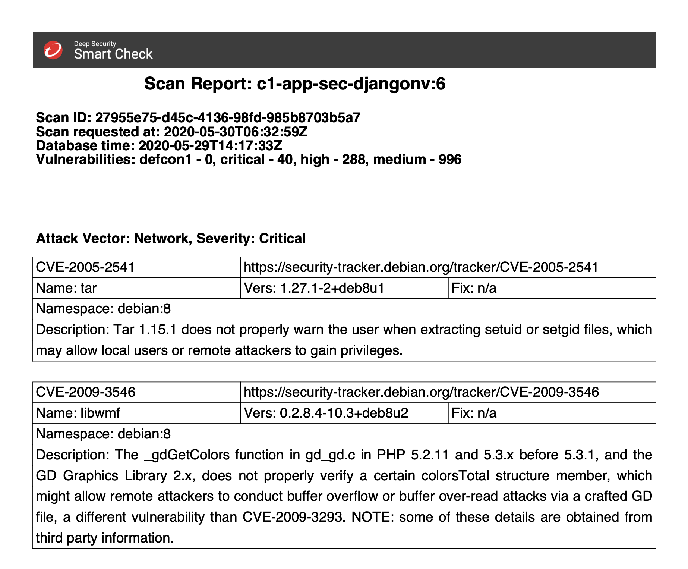

# Smart Check Scan-Report

- [Smart Check Scan-Report](#smart-check-scan-report)
  - [Container Variant](#container-variant)
  - [Pipeline Integration](#pipeline-integration)
  - [Support](#support)
  - [Contribute](#contribute)

Reports discovered vulnerabilities by Cloud One Image Security. If multiple scans have been requested for the given image, the latest scan is evaluated.

First, create your config.yml by

```sh
cp config.yml.sample config.yml
```

and define the values.
Sample:

```yaml
dssc:
  service: "<smart check url:port>"
  username: "<smart check username>"
  password: "<smart check password>"

repository:
  name: "<repository name>"
  image_tag: "<image tag, e.g. latest>"

criticalities:
  - defcon1
  - critical
  - high
  - medium
```

Run the reporter by

```sh
python3 scan-report.py
```

Optional command line arguments:

```sh
"-c", "--config_path", type=str, help="path to config.yml"
"-n", "--name", type=str, help="image name"
"-t", "--image_tag", type=str, help="image tag"
"-o", "--out_path", type=str, help="output directory"
"-s", "--service", type=str, help="image security url"
"-u", "--username", type=str, help="username"
"-p", "--password", type=str, help="password"
"-O", "--stdout", action='store_true', help="output to stdout"
```

Output created:

- Findings by Smart Check as PDF
- Vulnerabilities sorted
  - AV: Network, Severity: Critical (including detailed info)
  - AV: Network, Severity: High  (including detailed info)
  - The rest (CVE and link only)

Example:


## Container Variant

Build

```sh
docker build -t scan-report .
```

Run

```sh
docker run scan-report -O \
  --config_path "/usr/src/app" \
  --name "${TARGET_IMAGE}" \
  --image_tag "${TARGET_IMAGE_TAG}" \
  --out_path "." \
  --service "${DSSC_SERVICE}" \
  --username "${DSSC_USERNAME}" \
  --password "${DSSC_PASSWORD}" > report_${TARGET_IMAGE}.pdf
```

## Pipeline Integration

Scripted pipeline example:

```java
parallel (
  "Test": {
    echo 'All functional tests passed'
  },
  "Check Image (pre-Registry)": {
    try {
      smartcheckScan([
        imageName: "${REPOSITORY}:${BUILD_NUMBER}",
        smartcheckHost: "${DSSC_SERVICE}",
        smartcheckCredentialsId: "smartcheck-auth",
        insecureSkipTLSVerify: true,
        insecureSkipRegistryTLSVerify: true,
        preregistryScan: true,
        preregistryHost: "${DSSC_REGISTRY}",
        preregistryCredentialsId: "preregistry-auth",
        findingsThreshold: new groovy.json.JsonBuilder([
          malware: 0,
          vulnerabilities: [
            defcon1: 0,
            critical: 0,
            high: 0,
          ],
          contents: [
            defcon1: 0,
            critical: 0,
            high: 0,
          ],
          checklists: [
            defcon1: 0,
            critical: 0,
            high: 0,
          ],
        ]).toString(),
      ])
    } catch(e) {
      withCredentials([
        usernamePassword(
          credentialsId: 'smartcheck-auth',
          usernameVariable: 'SMARTCHECK_AUTH_CREDS_USR',
          passwordVariable: 'SMARTCHECK_AUTH_CREDS_PSW'
        )
      ]) { script {
        docker.image('mawinkler/scan-report').pull()
        docker.image('mawinkler/scan-report').inside("--entrypoint=''") {
          sh """
            python /usr/src/app/scan-report.py \
              --config_path "/usr/src/app" \
              --name "${REPOSITORY}" \
              --image_tag "${BUILD_NUMBER}" \
              --out_path "${WORKSPACE}" \
              --service "${DSSC_SERVICE}" \
              --username "${SMARTCHECK_AUTH_CREDS_USR}" \
              --password "${SMARTCHECK_AUTH_CREDS_PSW}"
          """
          archiveArtifacts artifacts: 'report_*.pdf'
        }
        error('Issues in image found')
      } }
    }
  }
)
```

## Support

This is an Open Source community project. Project contributors may be able to help, depending on their time and availability. Please be specific about what you're trying to do, your system, and steps to reproduce the problem.

For bug reports or feature requests, please [open an issue](../../issues). You are welcome to [contribute](#contribute).

Official support from Trend Micro is not available. Individual contributors may be Trend Micro employees, but are not official support.

## Contribute

I do accept contributions from the community. To submit changes:

1. Fork this repository.
1. Create a new feature branch.
1. Make your changes.
1. Submit a pull request with an explanation of your changes or additions.

I will review and work with you to release the code.
